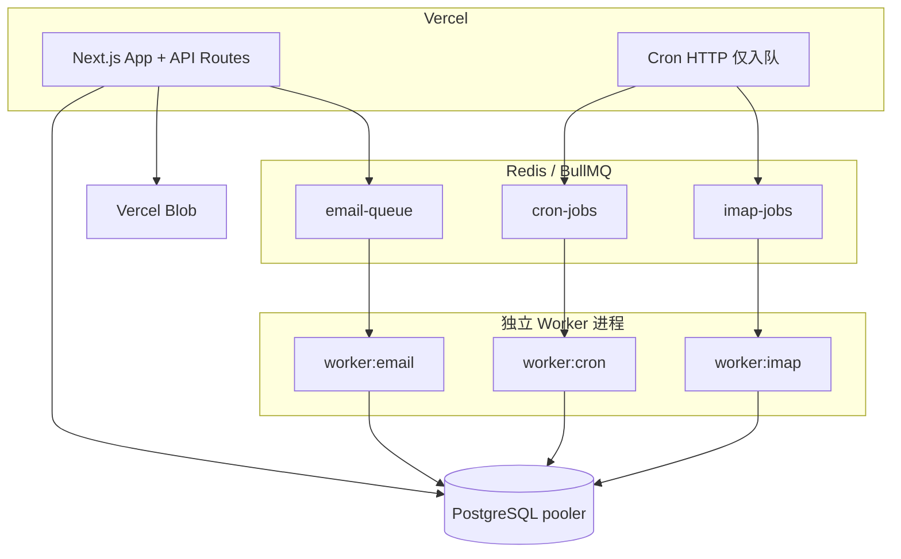

# OutreachHub 架构模块索引

> 最后更新：2026-05-30（架构演进 Phase 1–3）  
> Agent 开发前请先读 [`CLAUDE.md`](../CLAUDE.md) 硬性规则。

## 系统拓扑



## 模块职责表

### 邮件发送

| 模块 | 路径 | 职责 |
|------|------|------|
| 队列生产者 | `src/lib/email-queue.ts` | 入队；无 Redis 降级 `sendEmailDirectly` |
| 队列消费者 | `src/lib/email-worker.ts` | SMTP 发送、EmailLog、追踪、Campaign 完成判定 |
| 平台 SMTP | `src/lib/email.ts` → `sendPlatformMail` | 系统邮件 only |
| 用户 SMTP | `src/lib/email-account-mail.ts` → `sendAccountMail` | Campaign / Inbox |
| 账户选择 | `src/lib/select-email-account.ts` | 按健康度 + 日限额轮换 |
| Worker 启动 | `scripts/start-email-worker.ts` | 含 health :8080 |

### Cron / 定时任务

| 模块 | 路径 | 职责 |
|------|------|------|
| HTTP 入口 | `src/app/api/cron/*/route.ts` | 鉴权 + `dispatchCronJob` / `dispatchImapCheck` |
| 路由辅助 | `src/lib/cron-route.ts` | 统一 Cron HTTP 响应 |
| 队列入队 | `src/lib/cron-queue.ts`, `imap-queue.ts` | BullMQ 生产者 |
| 业务逻辑 | `src/lib/cron-jobs/*.ts` | **所有 Cron 业务放这里** |
| 调度分发 | `src/lib/cron-handlers.ts` | Worker 消费时调用 |
| Cron Worker | `src/lib/cron-worker.ts`, `scripts/start-cron-worker.ts` | 消费 `cron-jobs` |
| IMAP Worker | `scripts/start-imap-worker.ts` | 消费 `imap-jobs` |
| IMAP 收信 | `src/lib/imap-multi.ts` | 多账户 IMAP + 回复分类 |

### 数据与租户

| 模块 | 路径 | 职责 |
|------|------|------|
| Schema | `prisma/schema.prisma` | 含 `CampaignContact` 关联表 |
| Campaign 联系人 | `src/lib/campaign-contacts.ts` | **读写联系人唯一入口** |
| 租户过滤 | `src/lib/auth-middleware.ts` → `tenantWhere()` | API 层隔离 |
| 套餐限额 | `src/lib/plan-limits.ts` | FREE/BASIC/PRO/ENTERPRISE |
| Campaign 完成 | `src/lib/campaign-completion.ts` | 用 `getCampaignContactIds` |

### 基础设施

| 模块 | 路径 | 职责 |
|------|------|------|
| 环境校验 | `src/lib/env.ts`, `src/instrumentation.ts` | 生产启动检查 |
| JWT | `src/lib/jwt.ts` | 无 fallback secret |
| Cron 鉴权 | `src/lib/cron-auth.ts` | 生产强制 CRON_SECRET |
| Redis | `src/lib/redis.ts` | 连接、缓存、SCAN 删键 |
| 限流 | `src/lib/rate-limit.ts` | Redis 分布式 + 内存降级 |
| 实时事件 | `src/lib/events.ts` | Redis Pub/Sub |
| 统计预聚合 | `src/lib/stats-aggregate.ts` | Dashboard Redis 计数 |
| 文件存储 | `src/lib/storage.ts` | Blob / 本地 |
| Worker 健康 | `src/lib/worker-health.ts` | GET /health |

### 部署

| 文件 | 说明 |
|------|------|
| `docs/deployment.md` | 生产部署步骤 |
| `docker-compose.yml` | postgres + redis + worker + cron-worker + imap-worker |
| `Dockerfile.worker` | Worker 镜像 |
| `vercel.json` | Vercel Cron 调度 |
| `.github/workflows/ci.yml` | CI pipeline |
| `.env.example` | 环境变量模板 |

## 已废弃 / 勿再使用的模式

| 旧模式 | 替代方案 |
|--------|----------|
| Cron route 内写大段业务 | `src/lib/cron-jobs/` + cron-worker |
| 直接读 `campaign.contactIds[]` 发信 | `getCampaignContactIds()` |
| `tenantWhere()` 空实现 | `tenantWhere(tenantId, filter)` |
| 进程内 Rate Limit store | Redis INCR（`rate-limit.ts`） |
| 进程内 EmailEventEmitter only | Redis Pub/Sub（`events.ts`） |
| `public/uploads` 直接写文件 | `uploadFile()` in `storage.ts` |
| JWT fallback secret | `getJwtSecret()` 生产 throw |
| Cron 无 secret 放行 | 生产 503 |
| Redis KEYS 删缓存 | SCAN（`redis.ts`） |

## Campaign 联系人数据流

```
前端 PATCH contactIds
  → campaigns/[id]/route.ts
  → replaceCampaignContacts()     # 写 CampaignContact 表
  → Campaign.contactIds[]         # 遗留字段同步保留

Launch / Cron 发信
  → getCampaignContactIds()       # 优先 CampaignContact
  → addBulkEmailJobs()
  → email-worker
  → updateCampaignContactStatus(SENT)
```
